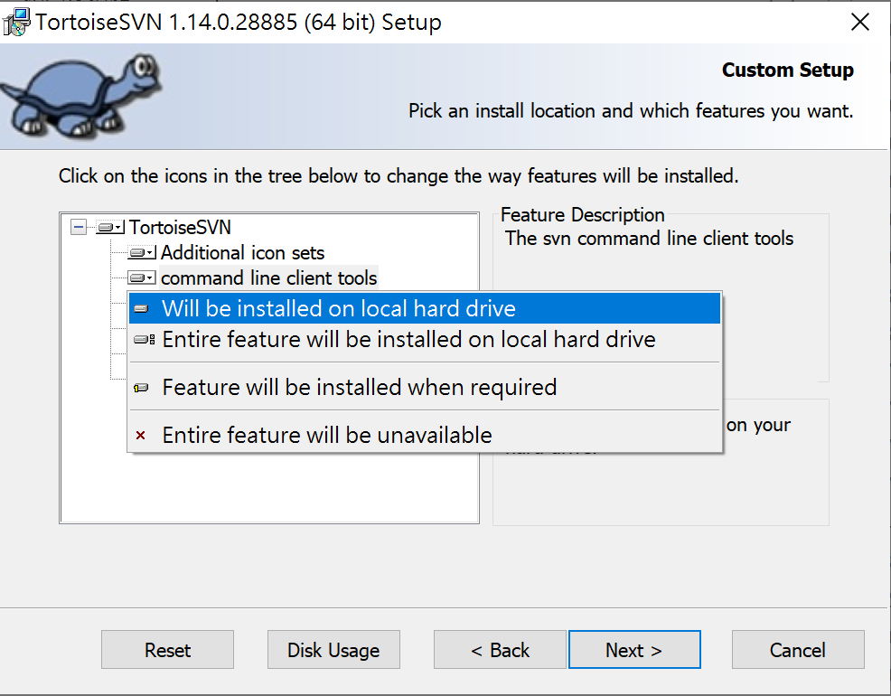

# 下載Github Repo中特定資料夾內容

1. 下載SVN Tools (在安裝時，記得將command line tools安裝選項變更為安裝)

下載點：[https://tortoisesvn.net/downloads.html](https://tortoisesvn.net/downloads.html)



2.在終端機中下指令：

```bash
svn checkout https://github.com/UserName/trunk/specific_folder_name
```

以今天為例就是：

```bash
svn checkout [https://github.com/ryan403/reactor-sh/trunk/data-science](https://github.com/ryan403/reactor-sh/trunk/data-science)
```